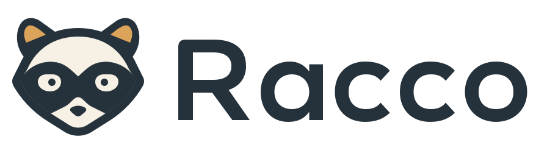
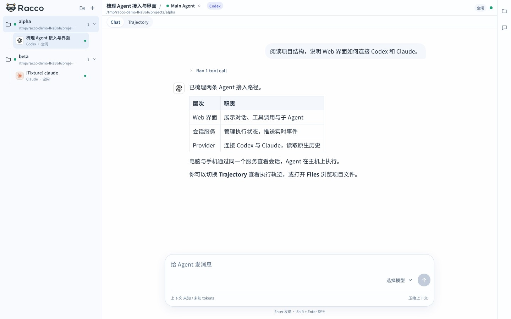
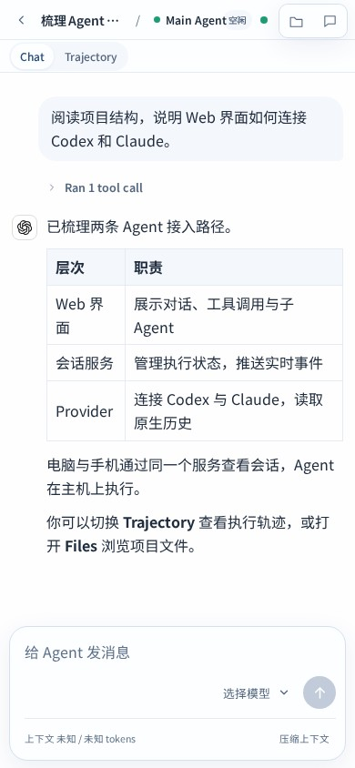

  <picture>
    <source media="(prefers-color-scheme: dark)" srcset="assets/brand/racco/racco-logo-dark.svg">
    
  </picture>

<strong>Agent 多端协作控制台</strong>

## Demo

<table>
  <tr>
    <th>桌面</th>
    <th>手机</th>
  </tr>
  <tr>
    <td width="76%"></td>
    <td width="24%"></td>
  </tr>
</table>

## 为什么做 Racco

随着 Agent Harness 成为日常开发工具，指挥和监控 Agent 的需求也延伸到了手机上。Racco 关注两个问题：

- **远程入口分散**：不同厂商的远程方案与各自生态绑定，客户端迭代和网络访问条件也会影响使用体验。需要一个统一入口，集中管理不同 Harness 的会话。
- **终端不适合小屏**：通过 PTY 直接呈现 CLI 界面，终端布局和交互方式难以适配手机。移动端需要适合阅读、触控和快速回复的界面。

## 核心能力

- **多端操作**：响应式 WebUI，在电脑上开始任务，在手机上查看进度、继续对话、回复问题或中断执行。
- **统一接入**：前后端分离，通过 Codex App Server 与 Claude Agent SDK 封装统一 Agent 驱动，按项目管理、新建或导入原生会话。
- **过程可视化**：统一流式消息、工具调用和子 Agent 轨迹的事件表达，在对话与执行轨迹视图中查看任务如何推进。
