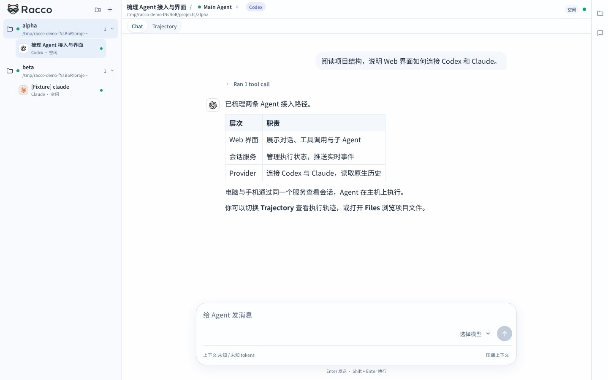
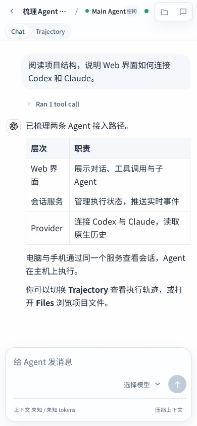

<p align="center">
  <picture>
    <source media="(prefers-color-scheme: dark)" srcset="assets/brand/racco/racco-logo-dark.svg">
    
  </picture>
</p>

<p align="center"><strong>Agent 多端协作控制台</strong></p>

## Demo

<table>
  <tr>
    <th>桌面</th>
    <th>手机</th>
  </tr>
  <tr>
    <td width="76%"></td>
    <td width="24%"></td>
  </tr>
</table>

## 为什么做 Racco

随着 Agent Harness 成为日常开发工具，指挥和监控 Agent 的需求也延伸到了手机上。Racco 关注两个问题：

- **远程入口分散**：不同厂商的远程方案与各自生态绑定，客户端迭代和网络访问条件也会影响使用体验。需要一个统一入口，集中管理不同 Harness 的会话。
- **终端不适合小屏**：通过 PTY 直接呈现 CLI 界面，终端布局和交互方式难以适配手机。移动端需要适合阅读、触控和快速回复的界面。

## 核心能力

- **多端操作**：响应式 WebUI，在电脑上开始任务，在手机上查看进度、继续对话、回复问题或中断执行。
- **图片输入**：聊天中选择、粘贴或拖拽静态 PNG、JPEG、WebP，支持多图和纯图片发送。
- **统一接入**：前后端分离，通过 Codex App Server 与 Claude Agent SDK 封装统一 Agent 驱动，按项目管理、新建或导入原生会话。
- **过程可视化**：统一流式消息、工具调用和子 Agent 轨迹的事件表达，在对话与执行轨迹视图中查看任务如何推进。

## 安装与启动（Linux 桌面）

Racco 运行在 Linux 桌面的 systemd **用户服务**中。需要 Node.js 26 或更新版本、npm、Git、`flock`（通常来自 util-linux）和 Python 3.10+（开发检查）。使用同一个 Linux 用户安装、登录原生客户端及运行服务；不要用 `sudo npm` 或 root 服务替代用户服务。

先准备 Codex CLI：`npm install -g @openai/codex@0.160.0`。在 Codex 与 Claude Code 原生客户端中完成账户登录，并确认它们能正常使用。Racco 使用同一用户的原生登录状态；它不会替你登录，也不要求把凭据写进仓库或 unit。

在桌面登录会话的终端执行：

```sh
git clone https://github.com/SToPire/racco.git
cd racco
node --version
git --version
flock --version
python3 --version
systemctl --user show-environment >/dev/null
npm ci
npm run install:service
npm run build
systemctl --user enable --now raccod.service
npm run doctor
```

打开 <http://127.0.0.1:7331>，在界面中选择宿主机上的项目目录。`install:service` 会把本检出链接到 `~/.local/share/racco`，并生成用户 unit，固定安装时选定的 Node 和 PATH；不要直接复制 `systemd/raccod.service` 模板。已有非符号链接目录不会被覆盖；需要重新安装到其他检出时，先停止服务，再运行安装命令。

默认配置在 `racco.config.json`：监听 `127.0.0.1:7331`；状态默认保存在 `${XDG_STATE_HOME:-~/.local/state}/racco`；`stateDir` 与 `worktreeRoot` 可显式设置，相对路径基于配置文件所在目录。生产状态只允许一个实例持有；不要手工删除运行中的状态目录或锁文件。

常用维护命令：

```sh
npm run daemon:status
journalctl --user -u raccod.service -n 100 --no-pager
systemctl --user stop raccod.service
systemctl --user start raccod.service
npm run doctor -- --json
```

更新前结束或中断正在执行的任务。在检出中完成更新和 `npm ci` 后运行 `npm run build`：当前检出的服务会先停止，完整构建成功后重启并确认构建标识；编译或启动失败时恢复前一构建。依赖安装、配置和数据库变更不属于产物回滚范围。更新期间连接会断开，恢复后刷新页面；不保留旧版本的 hash 资源。只验证代码而不发布时使用 `npm run check` 或 `npm run build:check`。

Node/CLI 的安装路径变化时，执行 `systemctl --user stop raccod.service` 后重新 `npm run install:service`，再启动。doctor 的 `shell-*` 检查只描述当前终端，`service-*` 才验证服务实际使用的程序与环境；Provider 不可用时同时检查原生登录状态和服务日志。

## 从另一台设备访问

可信 Host、Origin 与 Tailscale/HTTPS 代理配置见[访问边界与远程入口](docs/remote-access.md)。

默认 HTTP 入口仅监听宿主回环地址。可通过 SSH 本地转发访问：在客户端运行 `ssh -N -L 7331:127.0.0.1:7331 用户名@Linux主机`，然后打开客户端的 <http://127.0.0.1:7331>。手机需要支持本地转发的 SSH 客户端。终端使用的项目路径始终属于运行 daemon 的 Linux 主机。

如果使用反向代理或 Tailscale 入口，应由外层提供受信任设备/用户的访问控制，并转发 WebSocket；Racco 的来源检查不替代身份认证。不要把未保护的端口直接开放到互联网。宿主仍需保持受支持的 Linux 桌面用户会话；本项目不提供服务器无头部署或其他 init 系统方案。

## 开发与验证

运行 `npm run dev:fixture` 启动隔离的临时项目、假 Provider 与 Vite；直接运行源码，不预先构建。要使用真实服务，显式运行 `npm run dev -- --backend http://127.0.0.1:7331`；退出开发服务器不会停止该服务。两种模式均支持前端热更新，fixture 后端改动后重启开发命令，真实服务后端改动后运行 `npm run build` 发布。`npm run preview` 则用于构建后的隔离预览。

`npm run check` 手动执行 Notes、lint、格式、类型、单元测试、构建和浏览器验收。首次运行浏览器测试前执行 `npx playwright install chromium`，并按提示准备浏览器系统依赖。报告位于 `.tmp/check/` 与 `.tmp/playwright-report/`。真实 Provider smoke 会调用模型，独立于默认检查；执行前阅读相应脚本的目标与清理说明。

## Worktree

导入 Git 项目时请选择仓库的主工作区根目录；子目录、链接 Worktree 和裸仓库不能作为独立项目导入。普通非 Git 目录仍可直接使用。

需要 `git`：每个项目下可以并行多个 Worktree，列表实时来自 `git worktree list`，因此终端里手工建的 Worktree 也会出现。Racco 自己创建的 Worktree 放在 `~/.local/share/racco/worktrees/<项目>-<路径摘要>/`，可在 `racco.config.json` 里用 `worktreeRoot` 改到别处（该项只约束创建位置，不影响列表）。

安装步骤把本检出软链到 `~/.local/share/racco`，因此默认的 Worktree 落点位于本检出内，已在 `.gitignore` 中忽略。在本检出中清理时请用 `git clean -df`，**不要**用 `-x`——它会连同这些 Worktree 一起删掉。

列表不会自动刷新：在 Racco 之外改动 Worktree 后，点项目行的刷新按钮。
